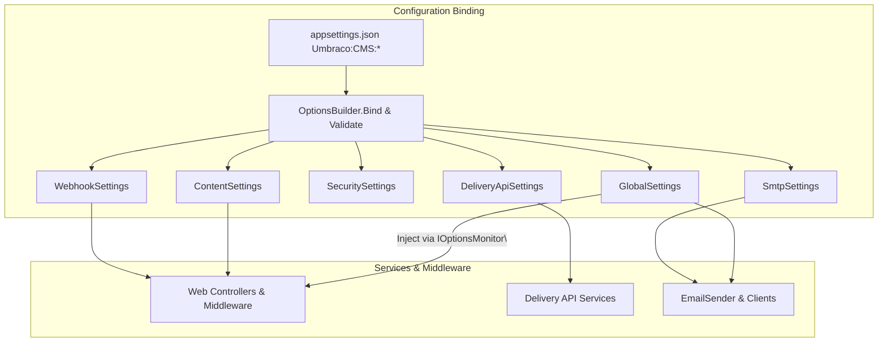

# 1.2 Configure the CMS (appsettings domains that impact runtime)

## Overview

The **Configure the CMS** section explains how Umbraco’s runtime behavior can be customized via `appsettings.json` under the `Umbraco:CMS` hierarchy. By binding strongly-typed options classes to configuration sections, developers gain compile-time safety and discoverability when adjusting settings such as request timeouts, security policies, content upload rules, Delivery API filters, webhook delivery, and SMTP email parameters.

This approach decouples configuration concerns from code, allowing for environment-specific overrides (e.g., `appsettings.Development.json` vs. Production) and enabling features like hot-reload via `IOptionsMonitor<T>`. Validators ensure any changes adhere to minimum requirements, guarding against misconfiguration in production.

## Architecture Overview

## Configuration Domains

All configuration models are decorated with `[UmbracoOptions("<section>")]`, binding the corresponding `appsettings.json` section under `Umbraco:CMS`. Each options class defines default values via `[DefaultValue]` and holds only public properties.

### Global Settings

Appsettings Section: `Umbraco:CMS:Global`

| Property | Type |
| --- | --- |
| ReservedUrls | string |
| ReservedPaths | string |
| TimeOut | TimeSpan |
| DefaultUILanguage | string |
| HideTopLevelNodeFromPath | bool |
| UseHttps | bool |
| VersionCheckPeriod | int |
| IconsPath | string |
| UmbracoCssPath | string |
| UmbracoScriptsPath | string |
| UmbracoMediaPath | string |
| DisableElectionForSingleServer | bool |
| NoNodesViewPath | string |
| DistributedLockingReadLockDefaultTimeout | TimeSpan |
| DistributedLockingWriteLockDefaultTimeout | TimeSpan |
| MainDomReleaseSignalPollingInterval | int |
| ForceCombineUrlPathLeftToRight | bool |
| ShowMaintenancePageWhenInUpgradeState | bool |
| DatabaseServerRegistrar | DatabaseServerRegistrarSettings |
| DatabaseServerMessenger | DatabaseServerMessengerSettings |
| Smtp | SmtpSettings? |

#### Validator

`GlobalSettingsValidator` enforces

1. A valid `Smtp.From` when `Smtp` is provided
2. `DistributedLockingWriteLockDefaultTimeout.TotalMilliseconds >= 100`

---

### Content Settings

Appsettings Section: `Umbraco:CMS:Content`

| Property | Type |
| --- | --- |
| Notifications | ContentNotificationSettings |
| Imaging | ContentImagingSettings |
| ResolveUrlsFromTextString | bool |
| Error404Collection | IEnumerable<ContentErrorPage> |
| PreviewBadge | string |
| ShowDeprecatedPropertyEditors | bool |
| LoginBackgroundImage | string |
| LoginLogoImage | string |
| LoginLogoImageAlternative | string |
| BackOfficeLogo | string |
| BackOfficeLogoAlternative | string |
| HideBackOfficeLogo | bool |
| DisableDeleteWhenReferenced | bool |
| DisableUnpublishWhenReferenced | bool |
| AllowEditInvariantFromNonDefault | bool |
| ShowDomainWarnings | bool |
| ShowUnroutableContentWarnings | bool |
| AllowedUploadedFileExtensions | ISet<string> |
| DisallowedUploadedFileExtensions | ISet<string> |

#### Validator

`ContentSettingsValidator` ensures

- Each `Error404Collection` entry has one of ContentId/ContentKey/ContentXPath and non-empty Culture
- Each `Imaging.AutoFillImageProperties` entry defines all required aliases

---

### Security Settings

Appsettings Section: `Umbraco:CMS:Security`

| Property | Type |
| --- | --- |
| KeepUserLoggedIn | bool |
| HideDisabledUsersInBackOffice | bool |
| AllowPasswordReset | bool |
| AuthCookieName | string |
| AuthCookieDomain | string? |
| UsernameIsEmail | bool |
| MemberRequireUniqueEmail | bool |
| AllowedUserNameCharacters | string |
| MemberBypassTwoFactorForExternalLogins | bool |
| UserBypassTwoFactorForExternalLogins | bool |
| MemberDefaultLockoutTimeInMinutes | int |
| UserDefaultLockoutTimeInMinutes | int |
| UserDefaultFailedLoginDurationInMilliseconds | long |
| UserMinimumFailedLoginDurationInMilliseconds | long |
| AuthorizeCallbackPathName | string |
| AuthorizeCallbackLogoutPathName | string |
| AuthorizeCallbackErrorPathName | string |
| PasswordResetEmailExpiry | TimeSpan |
| UserInviteEmailExpiry | TimeSpan |
| BackOfficeHost | Uri? |

#### Validator

`SecuritySettingsValidator` enforces that `BackOfficeHost`, if set, is an absolute URI with no path or query

---

### Delivery API Settings

Appsettings Section: `Umbraco:CMS:DeliveryApi`

| Property | Type |
| --- | --- |
| Enabled | bool |
| PublicAccess | bool |
| ApiKey | string? |
| DisallowedContentTypeAliases | ISet<string> |
| AllowedContentTypeAliases | ISet<string> |
| RichTextOutputAsJson | bool |
| Media | DeliveryApiSettings.MediaSettings |
| MemberAuthorization | MemberAuthorizationSettings? |
| OutputCache | OutputCacheSettings |

#### Validator

`DeliveryApiSettingsValidator` logs a warning if any alias appears in both allow and disallow lists (but still succeeds)

---

### Webhook Settings

Appsettings Section: `Umbraco:CMS:Webhook`

| Property | Type |
| --- | --- |
| Enabled | bool |
| MaximumRetries | int |
| Period | TimeSpan |
| EnableLoggingCleanup | bool |
| KeepLogsForDays | int |
| PayloadType | WebhookPayloadType |

Validators for webhook payloads reside in the webhook event system, ensuring retry policies adhere to settings.

---

### SMTP Settings

Appsettings Section: `Umbraco:CMS:Global:Smtp`

| Property | Type |
| --- | --- |
| From | string |
| Host | string? |
| Port | int |
| SecureSocketOptions | SecureSocketOptions |
| PickupDirectoryLocation | string? |
| DeliveryMethod | SmtpDeliveryMethod |
| Username | string? |
| Password | string? |
| EmailExpiration | TimeSpan? |

Inherited from `ValidatableEntryBase`, requiring `[EmailAddress]` on `From`.

---

## Environment-Specific Overrides

- **appsettings.Development.json** can override SMTP for local testing, enable hosting debug, lower security constraints (e.g., disable HTTPS enforcement) .
- **appsettings.Production.json** should enforce `UseHttps=true`, retain default timeouts, and configure real SMTP credentials.
- Overrides follow the hierarchical `Umbraco:CMS:{Section}` path.

## Safe vs. Production Changes

- **Safe in Development**:- `Hosting:Debug`, lower timeouts for rapid feedback (`TimeOut`, `DistributedLocking*Timeout`)
- SMTP pointing to dev SMTP (e.g., smtp4dev)
- Delivery API `Enabled=false` or test aliases

- **Production Recommendations**:- `UseHttps=true`
- `DistributedLockingWriteLockDefaultTimeout ≥ 5s`
- Valid `Smtp.From`, `Host`, `Port` with TLS/SSL (`SecureSocketOptions`)
- Maintain `VersionCheckPeriod` for update notifications

## Validators Summary

| Validator | Options Type | Enforcement |
| --- | --- | --- |
| GlobalSettingsValidator | GlobalSettings | Valid `Smtp.From`; `DistributedLockingWriteLockDefaultTimeout ≥100ms` |
| ContentSettingsValidator | ContentSettings | Non-empty `Culture` in `Error404Collection`; complete `Imaging.AutoFillImageProperties` entries |
| SecuritySettingsValidator | SecuritySettings | `BackOfficeHost` absolute URI with no path/query |
| DeliveryApiSettingsValidator | DeliveryApiSettings | Warn on overlapping allow/disallow content type aliases |
| RequestHandlerSettingsValidator | RequestHandlerSettings | `ConvertUrlsToAscii` ∈ { "true","try","false" } (via data annotations) |

## Key Classes Reference

| Class | Location | Responsibility |
| --- | --- | --- |
| GlobalSettings | src/Umbraco.Core/Configuration/Models/GlobalSettings.cs | Global runtime settings |
| ContentSettings | src/Umbraco.Core/Configuration/Models/ContentSettings.cs | Content upload & error page settings |
| SecuritySettings | src/Umbraco.Core/Configuration/Models/SecuritySettings.cs | Back-office and member security configuration |
| DeliveryApiSettings | src/Umbraco.Core/Configuration/Models/DeliveryApiSettings.cs | Headless Delivery API filters & caching |
| WebhookSettings | src/Umbraco.Core/Configuration/Models/WebhookSettings.cs | Webhook delivery & retry policies |
| SmtpSettings | src/Umbraco.Core/Configuration/Models/SmtpSettings.cs | SMTP email parameters |
| GlobalSettingsValidator | src/Umbraco.Core/Configuration/Models/Validation/GlobalSettingsValidator.cs | Validates global settings |
| ContentSettingsValidator | src/Umbraco.Core/Configuration/Models/Validation/ContentSettingsValidator.cs | Validates content settings |
| SecuritySettingsValidator | src/Umbraco.Core/Configuration/Models/Validation/SecuritySettingsValidator.cs | Validates security settings |
| DeliveryApiSettingsValidator | src/Umbraco.Core/Configuration/Models/Validation/DeliveryApiSettingsValidator.cs | Warns on Delivery API config overlaps |

This documentation covers all runtime-impacting appsettings domains, their mapping to strongly-typed models, built-in validation, and guidance for environment-specific overrides.