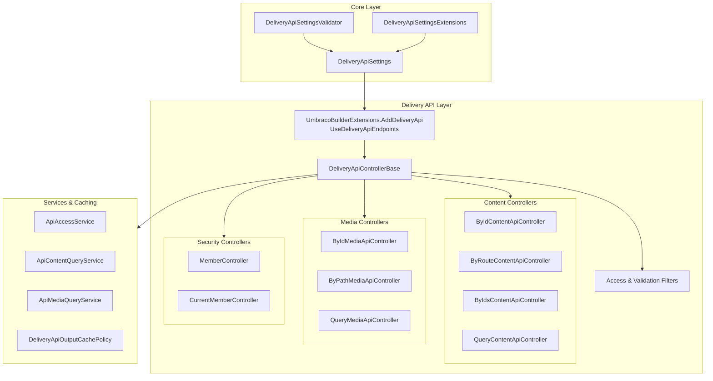

# Delivery API Quickstart Feature Documentation

## Overview

The Umbraco Delivery API exposes published content, media, and member-protected resources via REST, enabling true headless CMS scenarios. Built on ASP.NET Core and .NET 10, it supports API versioning (V1 and V2), configurable public or API-key access, OAuth 2.0 member flows, rich text rendering options, and output caching for high performance.

This quickstart guides you through enabling the Delivery API in your application, configuring access and caching policies, and consuming the core headless endpoints for content, media, and member authentication.

## Architecture Overview



## Component Structure

### 1. Configuration

#### DeliveryApiSettings (`src/Umbraco.Cms.Core/Configuration/Models/DeliveryApiSettings.cs`)

Typed options for enabling and customizing the Delivery API .

| Property | Type | Description |
| --- | --- | --- |
| Enabled | bool | Whether the Delivery API is enabled |
| PublicAccess | bool | If enabled, whether the API is publicly accessible or requires an API key |
| ApiKey | string? | API key for authorized or preview access |
| DisallowedContentTypeAliases | ISet<string> | Content type aliases never returned |
| AllowedContentTypeAliases | ISet<string> | When non‐empty, only these content types are returned |
| RichTextOutputAsJson | bool | Whether rich text is output as JSON instead of HTML |
| Media | DeliveryApiSettings.MediaSettings | Nested settings for media endpoints |
| MemberAuthorization | DeliveryApiSettings.MemberAuthorizationSettings? | Nested OAuth 2.0 flow settings |
| OutputCache | DeliveryApiSettings.OutputCacheSettings | Nested output caching settings |


**Nested Types**

– **MediaSettings**: Enabled (bool), PublicAccess (bool)

– **MemberAuthorizationSettings**:

• AuthorizationCodeFlow (AuthorizationCodeFlowSettings?)

• ClientCredentialsFlow (ClientCredentialsFlowSettings?)

– **AuthorizationCodeFlowSettings**: Enabled (bool), LoginRedirectUrls (IEnumerable<Uri>), LogoutRedirectUrls (IEnumerable<Uri>)

– **ClientCredentialsFlowSettings**: Enabled (bool), AssociatedMembers (IEnumerable<ClientCredentialsFlowMemberSettings>)

– **OutputCacheSettings**: Enabled (bool), ContentDuration (TimeSpan), MediaDuration (TimeSpan)

#### DeliveryApiSettingsValidator (`src/Umbraco.Cms.Core/Configuration/Models/Validation/DeliveryApiSettingsValidator.cs`)

Validates allow/disallow lists and logs warnings on overlap  .

| Parameter | Type |
| --- | --- |
| logger | ILogger\<DeliveryApiSettingsValidator\> |


**Public Methods**

| Method | Description |
| --- | --- |
| Validate | Always succeeds; logs warning if allow/disallow overlap |


#### DeliveryApiSettingsExtensions (`src/Umbraco.Cms.Core/Extensions/DeliveryApiSettingsExtensions.cs`)

Extension methods to evaluate allowed content types .

| Method | Description |
| --- | --- |
| IsAllowedContentType(this, string alias) | Returns true if alias passes allow/disallow logic |
| IsAllowedContentType(this, IPublishedContent) | Obsolete; delegates to alias overload |
| IsDisallowedContentType(this, string alias) | Obsolete; negates `IsAllowedContentType` |
| IsDisallowedContentType(this, IPublishedContent) | Obsolete; as above |


### 2. Bootstrapping

#### AddDeliveryApi (`src/Umbraco.Cms.Api.Delivery/DependencyInjection/UmbracoBuilderExtensions.cs`)

Registers Delivery API services, JSON options, OpenIddict, output caching, and Swagger .

#### UseDeliveryApiEndpoints (`src/Umbraco.Cms.Api.Delivery/DependencyInjection/UmbracoDeliveryApiApplicationBuilderExtensions.cs`)

Maps attribute-routed Delivery API controllers to endpoints .

### 3. Access Control

#### ApiAccessService (`src/Umbraco.Cms.Api.Delivery/Services/ApiAccessService.cs`)

Determines public, API-key, preview, and media access based on settings .

**Public Methods**

| Method | Description |
| --- | --- |
| HasPublicAccess | API enabled and (PublicAccess or valid API key) |
| HasPreviewAccess | API enabled and valid API key |
| HasMediaAccess | API & Media enabled and (PublicAccess or API key) |


### 4. Filters

| Filter | Description |
| --- | --- |
| DeliveryApiAccessAttribute | Ensures public or preview access; returns 401 Unauthorized if denied |
| DeliveryApiMediaAccessAttribute | Ensures media access; returns 401 if denied |
| ContextualizeFromAcceptHeadersAttribute | Populates culture/segment from headers into variation context |
| ValidateStartItemAttribute | Returns 404 if start-item provider fails |
| AddVaryHeaderAttribute | Appends `Vary: Accept-Language, Accept-Segment, Preview, Start-Item` to response |
| VersionedDeliveryApiRouteAttribute | Prefixes routes with `delivery/api/v{version}/…` |


### 5. API Endpoints

#### Get Content Item by ID

```api
{
    "title": "Get Content Item by ID",
    "description": "Retrieves a single published content item by its GUID.",
    "method": "GET",
    "baseUrl": "<deliveryApiBaseUrl>",
    "endpoint": "/umbraco/delivery/api/v2/content/item/{id}",
    "headers": [
        {
            "key": "Accept-Language",
            "value": "en-us",
            "required": false
        },
        {
            "key": "Accept-Segment",
            "value": "",
            "required": false
        },
        {
            "key": "Api-Key",
            "value": "<api-key>",
            "required": false
        },
        {
            "key": "Preview",
            "value": "false",
            "required": false
        },
        {
            "key": "Start-Item",
            "value": "",
            "required": false
        }
    ],
    "queryParams": [
        {
            "name": "expand",
            "type": "string",
            "description": "Properties to expand",
            "required": false
        }
    ],
    "pathParams": [
        {
            "name": "id",
            "type": "uuid",
            "description": "Content GUID",
            "required": true
        }
    ],
    "bodyType": "none",
    "requestBody": "",
    "formData": [],
    "rawBody": "",
    "responses": {
        "200": {
            "description": "Success",
            "body": "{\n    \"id\": \"b3e1f9d7-8a3f-4d1c-9e1b-123456789abc\",\n    \"contentType\": \"article\",\n    \"name\": \"My Article\",\n    \"createDate\": \"2025-02-15T10:30:00Z\",\n    \"updateDate\": \"2025-02-16T11:45:00Z\",\n    \"route\": {\n        \"path\": \"/articles/my-article\",\n        \"queryString\": null,\n        \"startItem\": {\n            \"id\": \"11111111-2222-3333-4444-555555555555\",\n            \"path\": \"/\"\n        }\n    },\n    \"properties\": {\n        \"bodyText\": \"<p>Hello World</p>\",\n        \"author\": \"Jane Doe\"\n    }\n}"
        },
        "401": {
            "description": "Unauthorized"
        },
        "403": {
            "description": "Forbidden"
        },
        "404": {
            "description": "Not Found"
        }
    }
}
```

#### Get Content Item by Path

```json
{
  "title": "Get Content Item by Path",
  "description": "Retrieves a single published content item by URL path.",
  "method": "GET",
  "baseUrl": "<deliveryApiBaseUrl>",
  "endpoint": "/umbraco/delivery/api/v2/content/item/{path}",
  "headers": [
    {"key": "Accept-Language","value":"en-us","required":false},
    {"key": "Accept-Segment","value":"","required":false},
    {"key": "Api-Key","value":"<api-key>","required":false},
    {"key": "Preview","value":"false","required":false},
    {"key": "Start-Item","value":"","required":false}
  ],
  "pathParams": [
    {"name":"path","type":"string","description":"Content URL path","required":true}
  ],
  "queryParams": [
    {"name":"expand","type":"string","description":"Properties to expand","required":false}
  ],
  "bodyType":"none",
  "requestBody":"",
  "formData":[],
  "rawBody":"",
  "responses":{
    "200":{
      "description":"Success",
      "body": {
        /* same shape as above */
      }
    },
    "404":{"description":"Not Found"}
  }
}
```

#### Get Multiple Content Items

```json
{
  "title": "Get Multiple Content Items",
  "description": "Retrieves multiple content items by GUIDs.",
  "method": "GET",
  "baseUrl": "<deliveryApiBaseUrl>",
  "endpoint": "/umbraco/delivery/api/v2/content/items?id={id1}&id={id2}",
  "headers":[ /* same as above */ ],
  "pathParams":[],
  "queryParams":[
    {"name":"id","type":"array of uuid","description":"GUIDs of items","required":true}
  ],
  "bodyType":"none",
  "requestBody":"",
  "formData":[],
  "rawBody":"",
  "responses":{
    "200":{
      "description":"Success",
      "body":[ /* array of content items */ ]
    }
  }
}
```

#### Query Content Items

```json
{
  "title": "Query Content Items",
  "description": "Fetches content with selectors (`fetch`), filters, sorts, pagination, and expansions.",
  "method": "GET",
  "baseUrl": "<deliveryApiBaseUrl>",
  "endpoint": "/umbraco/delivery/api/v2/content?fetch={option}&filter[]={opt}&sort[]={opt}&expand={props}&fields={props}&pageNumber=0&pageSize=10",
  "headers":[ /* same as above */ ],
  "pathParams":[],
  "queryParams":[
    {"name":"fetch","type":"string","description":"Selector option","required":false},
    {"name":"filter[]","type":"string","description":"Filter option","required":false},
    {"name":"sort[]","type":"string","description":"Sort option","required":false},
    {"name":"expand","type":"string","description":"Properties to expand","required":false},
    {"name":"fields","type":"string","description":"Properties to include","required":false},
    {"name":"pageNumber","type":"int","description":"Page index","required":false},
    {"name":"pageSize","type":"int","description":"Items per page","required":false}
  ],
  "bodyType":"none",
  "requestBody":"",
  "formData":[],
  "rawBody":"",
  "responses":{
    "200":{
      "description":"Success",
      "body":{"total":100,"items":["...guid..."]}
    }
  }
}
```

#### Get Media Item by ID

```api
{
    "title": "Get Media Item by ID",
    "description": "Retrieves a single media item by GUID.",
    "method": "GET",
    "baseUrl": "<deliveryApiBaseUrl>",
    "endpoint": "/umbraco/delivery/api/v2/media/item/{id}",
    "headers": [
        {
            "key": "Api-Key",
            "value": "<api-key>",
            "required": false
        }
    ],
    "queryParams": [],
    "pathParams": [
        {
            "name": "id",
            "type": "uuid",
            "description": "Media GUID",
            "required": true
        }
    ],
    "bodyType": "none",
    "requestBody": "",
    "formData": [],
    "rawBody": "",
    "responses": {
        "200": {
            "description": "Success",
            "body": "{\n    \"id\": \"c123...\",\n    \"name\": \"Image.jpg\",\n    \"mediaType\": \"image\",\n    \"url\": \"https://.../image.jpg\",\n    \"extension\": \"jpg\",\n    \"width\": 600,\n    \"height\": 400,\n    \"bytes\": 123456,\n    \"properties\": []\n}"
        },
        "401": {
            "description": "Unauthorized"
        },
        "404": {
            "description": "Not Found"
        }
    }
}
```

#### [Additional media endpoints and member security endpoints follow the same pattern]

## Caching Strategy

- Enabled via `OutputCacheSettings` (Enabled, ContentDuration, MediaDuration) .
- Policies: `DeliveryApiContent` and `DeliveryApiMedia` vary by headers `Accept-Language`, `Accept-Segment`, `Preview`, `Start-Item` .
- Preview or unauthorized responses are never cached.

## Key Classes Reference

| Class | Location | Responsibility |
| --- | --- | --- |
| DeliveryApiSettings | src/Umbraco.Cms.Core/Configuration/Models/DeliveryApiSettings.cs | Delivery API configuration model |
| DeliveryApiSettingsValidator | src/Umbraco.Cms.Core/Configuration/Models/Validation/DeliveryApiSettingsValidator.cs | Validates Delivery API config |
| UmbracoBuilderExtensions.AddDeliveryApi | src/Umbraco.Cms.Api.Delivery/DependencyInjection/UmbracoBuilderExtensions.cs | Registers Delivery API services |
| ApiAccessService | src/Umbraco.Cms.Api.Delivery/Services/ApiAccessService.cs | Access control logic |
| DeliveryApiOutputCachePolicy | src/Umbraco.Cms.Api.Delivery/Caching/DeliveryApiOutputCachePolicy.cs | Implements output caching policy |
| DeliveryApiControllerBase | src/Umbraco.Cms.Api.Delivery/Controllers/DeliveryApiControllerBase.cs | Base class for all Delivery API controllers |
| ContentApiControllerBase | src/Umbraco.Cms.Api.Delivery/Controllers/Content/ContentApiControllerBase.cs | Shared logic for content endpoints |
| MediaApiControllerBase | src/Umbraco.Cms.Api.Delivery/Controllers/Media/MediaApiControllerBase.cs | Shared logic for media endpoints |
| MemberController | src/Umbraco.Cms.Api.Delivery/Controllers/Security/MemberController.cs | OAuth 2.0 member authentication |


## Dependencies

- Umbraco.Cms.Core (models, services)
- Umbraco.Cms.Api.Common (OpenAPI, JSON, auth)
- Umbraco.Cms.Web.Common (hosting, backoffice integration)
- OpenIddict (OAuth 2.0 member flows)
- Asp.Versioning (API versioning)

## Testing Considerations

- Unit tests for configuration validator (`DeliveryApiSettingsValidatorTests`)
- Integration tests for Delivery API endpoints (`Umbraco.Tests.Integration` under DeliveryApi)
- Verify caching behavior and access filters in unit and acceptance tests.