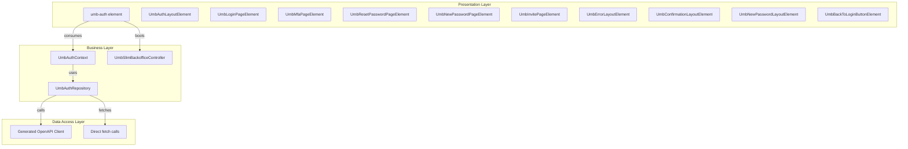
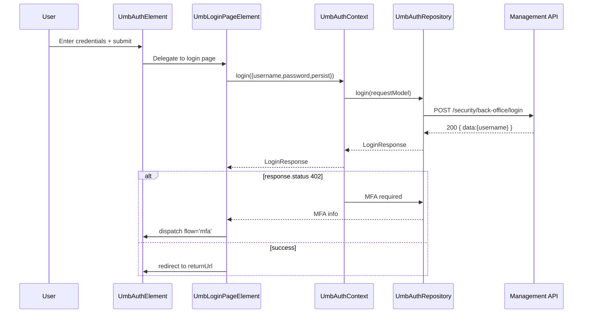

# Login SPA Feature Documentation

## Overview

The Login SPA provides a standalone, modern authentication interface for the Umbraco backoffice. Built with TypeScript, Lit, and Vite, it exposes the `<umb-auth>` web component to handle local login, multi-factor authentication (MFA), password reset, and user invitation flows. By encapsulating all authentication flows in a slim single-page application, it decouples startup from the full backoffice UI, improving performance and simplifying theming and testing.

This SPA integrates tightly with the backoffice host: it boots a minimal backoffice context, registers public extensions, and shares the same localization, icon registry, and server connection infrastructure used by the full backoffice application. It outputs a lightweight ES module bundle consumed by the main site under `/umbraco/login`.

## Architecture Overview



## Component Structure

### 1. Presentation Layer

#### **UmbAuthElement** (`src/Umbraco.Web.UI.Login/src/auth.element.ts`)

- **Purpose and responsibilities**

Renders the root `<umb-auth>` component, listens for flow change events, boots the slim backoffice context, waits for localization, then injects a light-DOM login form for proper browser autocomplete.

| Attribute | Type | Description |
| --- | --- | --- |
| `disable-local-login` | boolean | Disables local login, external only |
| `background-image` | string | Login page background URL |
| `logo-image` | string | Logo URL |
| `logo-image-alternative` | string | Alternative logo (dark mode) |
| `username-is-email` | boolean | Use email as username |
| `allow-password-reset` | boolean | Show password reset link |
| `allow-user-invite` | boolean | Enable user invitation flow |
| `return-url` | string | Redirect URL after login |


- **Attributes**
- **Key Methods**

| Method | Description |
| --- | --- |
| `firstUpdated()` | Registers `UmbSlimBackofficeController`, extensions, waits for localization, then calls `#initializeForm()` |
| `#initializeForm()` | Builds a light-DOM `<form>` with inputs, labels, and validation to support Chrome autofill (see Chrome issue) |
| `#waitForLocalization()` | Polls until `localize.term` returns real values, then resolves |
| `#renderFlowAndStatus()` | Chooses which flow component to render (`login`, `mfa`, `reset`, `invite`) based on URL query or `flow` property |
| `render()` | Wraps content in `<umb-auth-layout>` and injects the selected flow layout |


#### **UmbLoginPageElement** (`src/Umbraco.Web.UI.Login/src/components/pages/login.page.element.ts`)

- **Purpose**

Renders the username/password login page, handles form submission, updates UI states (`waiting`, `success`, `failed`), and dispatches flow change events for MFA or reset.

| Property | Type | Description |
| --- | --- | --- |
| `usernameIsEmail` | boolean | Whether username input is email |
| `allowPasswordReset` | boolean | Show "Forgotten password?" link |
| `supportPersistLogin` | boolean | Whether "Remember me" is supported |
| `_loginState` | string | Button state: `waiting` \ | `success` \ | `failed` |
| `_loginError` | string | Error message on failure |


- **Key Properties**
- **Key Methods**

| Method | Description |
| --- | --- |
| `#handleSubmit` | Prevents default, reads form data, calls `authContext.login`, handles response codes (including 402 MFA trigger) |
| `#onSubmitClick` | Triggers form submission |
| `#handleForgottenPassword` | Dispatches flow change to `reset` |
| `#renderErrorMessage` | Displays error span when `_loginState === 'failed'` |


#### Other Page & Layout Components

- **UmbMfaPageElement** (`src/components/pages/mfa.page.element.ts`): Renders MFA form or custom view, calls `authContext.validateMfaCode`, handles providers.
- **UmbResetPasswordPageElement** (`src/components/pages/reset-password.page.element.ts`): Renders email input for reset request, calls `authContext.resetPassword`.
- **UmbNewPasswordPageElement** (`src/components/pages/new-password.page.element.ts`): Verifies code via `authContext.validatePasswordResetCode`, then renders new password form calling `authContext.newPassword`.
- **UmbInvitePageElement** (`src/components/pages/invite.page.element.ts`): Validates invite code via `authContext.validateInviteCode`, then renders new-password layout, calls `authContext.newInvitedUserPassword`.
- **Layouts** (`src/components/layouts/*`):- `UmbAuthLayoutElement`: Shell with background, logo, content slot.
- `UmbErrorLayoutElement`: Single-page error layout.
- `UmbConfirmationLayoutElement`: Confirmation layout for actions.
- `UmbNewPasswordLayoutElement`: Layout wrapper for new password/invite flows.
- **UmbBackToLoginButtonElement** (`src/components/back-to-login-button.element.ts`): Renders a button to return to the default login form, dispatches `{flow:'login',status:null}`.

### 2. Business Layer

#### **UmbAuthContext** (`src/Umbraco.Web.UI.Login/src/contexts/auth.context.ts`)

- **Purpose**

Central authentication state and façade for all auth operations.

| Method | Description | Returns |
| --- | --- | --- |
| `login(data: LoginRequestModel)` | Authenticate user | `Promise<LoginResponse>` |
| `resetPassword(username: string)` | Request password reset | `Promise<ResetPasswordResponse>` |
| `validatePasswordResetCode(userId,code)` | Validate reset code | `Promise<ValidatePasswordResetCodeResponse>` |
| `newPassword(password,code,userId)` | Complete password reset | `Promise<NewPasswordResponse>` |
| `validateInviteCode(token,userId)` | Validate user invitation | `Promise<ValidateInviteCodeResponse>` |
| `newInvitedUserPassword(password,token,userId)` | Set password for invited user | `Promise<NewPasswordResponse>` |
| `validateMfaCode(code,provider)` | Validate MFA code | `Promise<MfaCodeResponse>` |


- **Dependencies**- Injects `UmbAuthRepository` for API calls.
- **Public Methods**
- **Return Path Security**

Sanitizes and only allows same-origin return URLs to prevent open redirects.

#### **UmbAuthRepository** (`src/Umbraco.Web.UI.Login/src/contexts/auth.repository.ts`)

- **Purpose**

Performs HTTP calls to management API, handles low-level error translation and JSON parsing.

- **Key Public Methods**

| Method | API Endpoint | Description |
| --- | --- | --- |
| `login(data)` | POST `/umbraco/management/api/v1/security/back-office/login` | Sends credentials, returns status/data or MFA info |
| `validateMfaCode(code,provider)` | POST `/umbraco/management/api/v1/security/back-office/verify-2fa` | Validates second factor code |
| `resetPassword(email)` | POST `/umbraco/management/api/v1/security/forgot-password` | Initiates reset email |
| `validatePasswordResetCode(user,resetCode)` | POST `/umbraco/management/api/v1/security/forgot-password/verify` | Verifies reset code, returns password policy |
| `newPassword(password,resetCode,user)` | POST `/umbraco/management/api/v1/security/forgot-password/reset` | Completes password reset |
| `validateInviteCode(token,user)` | POST `/umbraco/management/api/v1/user/invite/verify` | Checks invitation token |
| `newInvitedUserPassword(password,token,user)` | POST `/umbraco/management/api/v1/user/invite/create-password` | Sets password for invited user |


### 3. Data Access Layer

#### **Generated OpenAPI Client** (`src/Umbraco.Web.UI.Login/src/api`)

- Created via `openapi-ts.config.ts`, targeting `../Umbraco.Cms.Api.Management/OpenApi.json`, and filtered to include only the forgot-password and invite endpoints.
- Exposes typed functions:

`postSecurityForgotPassword`, `postSecurityForgotPasswordVerify`, `postSecurityForgotPasswordReset`, `postUserInviteVerify`, `postUserInviteCreatePassword` .

#### **Direct Fetch Calls**

- `UmbAuthRepository.login` and `validateMfaCode` use manual `fetch` requests to back-office login endpoints, outside the generated client.

## Data Models

All models are defined in `src/Umbraco.Web.UI.Login/src/types.ts` .

#### LoginRequestModel

| Property | Type | Description |
| --- | --- | --- |
| `username` | string | User identifier (username/email) |
| `password` | string | User password |
| `persist` | boolean | Remember me flag |


#### LoginResponse

| Property | Type | Description |
| --- | --- | --- |
| `status` | number | HTTP status code |
| `data?` | object | On success, `{ username: string }` |
| `twoFactorView?` | string | MFA view identifier when status is `402` |
| `twoFactorProviders?` | string[] | Available MFA provider names when status is `402` |
| `error?` | string | Error message on failure |


#### MfaCodeResponse

| Property | Type | Description |
| --- | --- | --- |
| `error?` | string | Validation error detail |


#### ResetPasswordResponse

| Property | Type | Description |
| --- | --- | --- |
| `error?` | string | Error detail if request fails |


#### ValidatePasswordResetCodeResponse

| Property | Type | Description |
| --- | --- | --- |
| `error?` | string | Error detail if verification fails |
| `passwordConfiguration?` | PasswordConfigurationModel | Password policy (min length, complexity) |


#### NewPasswordResponse

| Property | Type | Description |
| --- | --- | --- |
| `error?` | string | Error detail if setting new password |


#### ValidateInviteCodeResponse

| Property | Type | Description |
| --- | --- | --- |
| `error?` | string | Error detail if invite verification fails |
| `passwordConfiguration?` | PasswordConfigurationModel | Password policy for invited user |


#### PasswordConfigurationModel

| Property | Type | Description |
| --- | --- | --- |
| `minimumPasswordLength` | number | Minimum required length |
| `requireNonLetterOrDigit` | boolean | Must include non-alphanumeric character |
| `requireDigit` | boolean | Must include at least one digit |
| `requireLowercase` | boolean | Must include at least one lowercase |
| `requireUppercase` | boolean | Must include at least one uppercase |


## API Integration

**API Endpoints:**

- **POST** `/umbraco/management/api/v1/security/back-office/login`

Authenticates a user and either returns a session token or triggers MFA .

- **POST** `/umbraco/management/api/v1/security/back-office/verify-2fa`

Validates the provided MFA code .

- **POST** `/umbraco/management/api/v1/security/forgot-password`

Sends a password reset request for the specified email .

- **POST** `/umbraco/management/api/v1/security/forgot-password/verify`

Verifies a password reset code and returns password policy .

- **POST** `/umbraco/management/api/v1/security/forgot-password/reset`

Completes the password reset with the new password .

- **POST** `/umbraco/management/api/v1/user/invite/verify`

Validates an invitation token and returns password policy .

- **POST** `/umbraco/management/api/v1/user/invite/create-password`

Sets the password for an invited user .

**Request/Response Examples**

```json
{
  "username": "test@umbraco.com",
  "password": "Pa$$w0rd",
  "persist": true
}
```

```json
{
  "status": 200,
  "data": {
    "username": "test@umbraco.com"
  }
}
```

```json
{
  "passwordConfiguration": {
    "minimumPasswordLength": 8,
    "requireNonLetterOrDigit": false,
    "requireDigit": true,
    "requireLowercase": true,
    "requireUppercase": true
  }
}
```

## Feature Flows

### 1. User Login Flow



## State Management

Authentication flows are driven by a `flow` state (`'login' | 'mfa' | 'reset' | 'reset-password' | 'invite-user'`) and optional `status` query parameter:

- **default (****`login`****)**: Username/password form
- **mfa**: MFA code entry
- **reset**: Email entry for reset
- **reset-password**: New password form
- **invite-user**: Invitation acceptance

## Integration Points

- **Slim Backoffice Bootstrap**: `UmbSlimBackofficeController` sets up minimal backoffice services, icon registry, extensions registry, and server context in `firstUpdated()` of `UmbAuthElement` .
- **Extension Registry**: The SPA registers its own `Umb.Auth.Bundle` via `umbraco-package.ts`, enabling shared loading of localization and UUI styles.
- **OpenAPI Generation**: The `openapi-ts.config.ts` generates a typed client under `src/api` used by `UmbAuthRepository` .
- **Build Output**: Vite outputs `login.js` to `../Umbraco.Cms.StaticAssets/wwwroot/umbraco/login/` for consumption by the backoffice host via `/umbraco/login`.

## Dependencies

- Node.js ≥ 22, npm ≥ 10.9
- Vite for build (`vite.config.ts`)
- Lit and Umbrella backoffice packages (`@umbraco-cms/backoffice`, `@umbraco-cms/backoffice/lit-element`)
- MSW for development mocks (`startMockServiceWorker`)
- `@hey-api/openapi-ts` for API client generation

## Key Classes Reference

| Class | Location | Responsibility |
| --- | --- | --- |
| UmbAuthElement | `src/auth.element.ts` | Root auth component, bootstraps flows |
| UmbLoginPageElement | `src/components/pages/login.page.element.ts` | Username/password login UI |
| UmbMfaPageElement | `src/components/pages/mfa.page.element.ts` | MFA code entry page |
| UmbResetPasswordPageElement | `src/components/pages/reset-password.page.element.ts` | Request password reset email |
| UmbNewPasswordPageElement | `src/components/pages/new-password.page.element.ts` | Set a new password after reset |
| UmbInvitePageElement | `src/components/pages/invite.page.element.ts` | Accept user invitation and set password |
| UmbAuthLayoutElement | `src/components/layouts/auth-layout.element.ts` | Layout shell for auth pages |
| UmbErrorLayoutElement | `src/components/layouts/error-layout.element.ts` | Error display layout |
| UmbConfirmationLayoutElement | `src/components/layouts/confirmation-layout.element.ts` | Confirmation message layout |
| UmbNewPasswordLayoutElement | `src/components/layouts/new-password-layout.element.ts` | New-password form layout |
| UmbBackToLoginButtonElement | `src/components/back-to-login-button.element.ts` | “Return to login” button |
| UmbAuthContext | `src/contexts/auth.context.ts` | Auth state and façade |
| UmbAuthRepository | `src/contexts/auth.repository.ts` | HTTP calls to management API |
| UmbSlimBackofficeController | `src/controllers/slim-backoffice-initializer.ts` | Minimal backoffice context initializer |


## Error Handling

All repository methods catch network and HTTP errors, translate them to user-friendly messages via localization keys, and return `{ error: string }` in the response model. MFA code validation explicitly handles 400 status as invalid code, while other statuses fallback to a generic server error message.

## Build & Deployment

- **Development**: `npm run dev` (Vite dev server with MSW mocks)
- **Production Build**: `npm run build` outputs `login.js` to StaticAssets
- **Watch Mode**: `npm run watch` for incremental build
- **API Client Generation**: `npm run generate:server-api` (runs `openapi-ts.config.ts`)

The built bundle is then served under `/umbraco/login` by the `BackOfficeLoginController` view for the backoffice host.