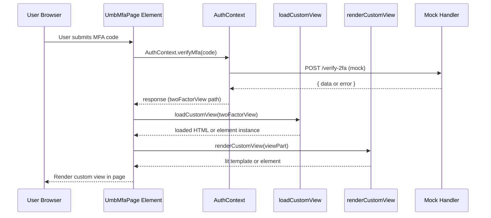

# 12.2 Login Mocks and Custom Views Loading Feature Documentation

## Overview

The Login Mocks and Custom Views Loading feature provides a self-contained mock environment for the back-office login SPA, enabling developers to work and test authentication flows entirely in the browser without a live API backend. It uses Mock Service Worker (MSW) to intercept HTTP calls and return in-memory data for login, multi-factor authentication (MFA), password reset, and asset requests. Additionally, it supports loading custom HTML or JavaScript view fragments—such as alternative MFA pages—via utility functions, allowing easy prototyping of bespoke UI components during development and automated tests.

## Architecture Overview

```mermaid
flowchart TB
    subgraph DevServer [Vite Dev Server]
      A[Start Vite] --> B[Import MSW worker]
      B --> C[startMockServiceWorker]
    end

    subgraph MSW [Mock Service Worker]
      C --> D[login.handlers.ts]
      C --> E[backoffice.handlers.ts]
    end

    subgraph UI [Login UI Components]
      F[umb-auth component] --> G[AuthContext]
      G -->|login()/MFA| H[MFA Page]
      H --> I[loadCustomView] 
      I --> J[Custom View Module]
      J --> K[renderCustomView]
    end
```

## Component Structure

### 1. Mock Service Worker Setup

#### startMockServiceWorker

*Path:* src/Umbraco.Web.UI.Login/src/mocks/index.ts

Bootstraps MSW in browser development mode. It configures the worker to log any unhandled requests (excluding static asset fetches) and then starts the worker.

Key Method

- `startMockServiceWorker(config?: StartOptions): Promise<WorkerRegistration>`

### 2. Mock Handlers

#### 2.1 Login Handlers

*Path:* src/Umbraco.Web.UI.Login/src/mocks/handlers/login.handlers.ts

Simulates authentication endpoints for manifest retrieval, login, password reset, and MFA code verification.

Handlers overview:

- GET `/umbraco/management/api/v1/manifest/manifest/public`: returns a test package manifest.
- POST `/umbraco/management/api/v1/security/back-office/login`: invokes in-memory login logic.
- POST `/umbraco/management/api/v1/security/forgot-password`: returns 200 OK.
- POST `/umbraco/management/api/v1/security/forgot-password/verify`: validates reset code.
- POST `/umbraco/management/api/v1/security/forgot-password/reset`: returns 204 No Content.
- POST `/umbraco/management/api/v1/security/back-office/verify-2fa`: simulates MFA code check.

#### 2.2 Backoffice Handlers

*Path:* src/Umbraco.Web.UI.Login/src/mocks/handlers/backoffice.handlers.ts

Mocks retrieval of graphic assets used on the login page by Proxying to local static SVG/JPEG files.

Handlers overview:

- GET `/security/back-office/graphics/logo`
- GET `/security/back-office/graphics/logo-alternative`
- GET `/security/back-office/graphics/login-logo`
- GET `/security/back-office/graphics/login-logo-alternative`
- GET `/security/back-office/graphics/login-background`

Each returns the appropriate ArrayBuffer with correct Content-Type header.

### 3. Mock Data

#### UmbLoginData

*Path:* src/Umbraco.Web.UI.Login/src/mocks/data/login.data.ts

Provides in-memory user profiles and reset code validation.

Methods:

| Method | Description |
| --- | --- |
| `login(email: string, password: string)` | Returns `{ data, status }` where `data` is user or `null`, `status` is HTTP status (200, 402, 404). |
| `validatePasswordResetCode(code: string)` | Returns `{ data?: { passwordConfiguration }, error?: string, status }`. |


Properties:

| Property | Type | Description |
| --- | --- | --- |
| `resetCodes` | `string[]` | Allowed password reset codes (`"valid"`, `"invalid"`). |
| `users` | `Array<{ id: string; name: string; email: string; password: string; twoFactor: boolean; twoFactorLoginView?: string; enabledTwoFactorProviderNames?: string[] }>` | Test user entries, some configured with `twoFactorLoginView` paths for custom views. |


### 4. Custom Views

#### my-custom-view.html

*Path:* src/Umbraco.Web.UI.Login/src/mocks/customViews/my-custom-view.html

Simple HTML fragment rendered within an MFA page when `twoFactorLoginView` refers to this file.

```html
<uui-box headline="My custom view">
  <p>My custom view content</p>
</uui-box>
```

#### my-custom-view.js

*Path:* src/Umbraco.Web.UI.Login/src/mocks/customViews/my-custom-view.js

Defines `MyCustomView` custom element that renders a button and two dynamic spans (`providerName` / `userViewState`).

Key class members:

| Member | Type | Description |
| --- | --- | --- |
| `providerName` | `string` | External login provider name (injected in connectedCallback). |
| `userViewState` | `string` | User’s current view state (injected). |
| `constructor()` | — | Attaches shadow DOM, clones template, registers click listener. |
| `connectedCallback()` | — | Logs connection, sets text content of `#providerName` / `#userViewState`. |


Registration:

```js
customElements.define('my-custom-view', MyCustomView);
export default MyCustomView;
```

### 5. Utilities

#### isProblemDetails

*Path:* src/Umbraco.Web.UI.Login/src/utils/is-problem-details.function.ts

Type guard that detects RFC 7807-style ProblemDetails objects in API responses.

```ts
export function isProblemDetails(obj: unknown): obj is UmbProblemDetails {
  return (
    typeof obj === 'object' &&
    obj !== null &&
    'type' in obj &&
    'title' in obj &&
    'status' in obj &&
    'detail' in obj
  );
}
```

#### loadCustomView & renderCustomView

*Path:* src/Umbraco.Web.UI.Login/src/utils/load-custom-view.function.ts

Dynamically loads a custom view resource (HTML file or JS module) and wraps it for Lit rendering.

- `loadCustomView<T extends HTMLElement>(view: string): Promise<T | string>`- If `view` ends with `.html`, fetches and returns raw HTML text.
- Otherwise, dynamically imports the JS module and returns `new module.default()`.

- `renderCustomView<T extends HTMLElement>(view: T | string)`- If `view` is string, returns a Lit template via `unsafeHTML`.
- Otherwise, returns the element instance directly for slotting into the page.

## Feature Flows

### Custom MFA View Loading



## Key Classes Reference

| Class | Location | Responsibility |
| --- | --- | --- |
| `UmbLoginData` | src/Umbraco.Web.UI.Login/src/mocks/data/login.data.ts | Supplies in-memory user and reset code data |
| `startMockServiceWorker` | src/Umbraco.Web.UI.Login/src/mocks/index.ts | Initializes and starts MSW worker |
| `handlers` | src/Umbraco.Web.UI.Login/src/mocks/handlers/index.ts | Aggregates and exports all MSW request handlers |
| `login.handlers.ts` | src/Umbraco.Web.UI.Login/src/mocks/handlers/login.handlers.ts | Mocks authentication and MFA API endpoints |
| `backoffice.handlers.ts` | src/Umbraco.Web.UI.Login/src/mocks/handlers/backoffice.handlers.ts | Mocks graphic asset endpoints for login UI |
| `MyCustomView` | src/Umbraco.Web.UI.Login/src/mocks/customViews/my-custom-view.js | Example custom element for MFA custom view |
| `isProblemDetails` | src/Umbraco.Web.UI.Login/src/utils/is-problem-details.function.ts | Type guard for ProblemDetails-like objects |
| `loadCustomView` | src/Umbraco.Web.UI.Login/src/utils/load-custom-view.function.ts | Loads custom view resources (HTML/JS) |
| `renderCustomView` | src/Umbraco.Web.UI.Login/src/utils/load-custom-view.function.ts | Wraps loaded view into a Lit template or element |
