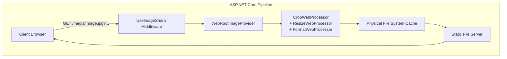
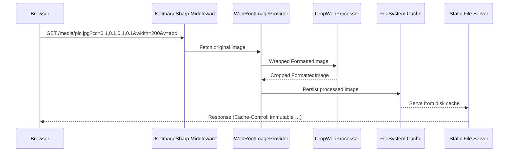

# 9.1 ImageSharp Integration Feature Documentation

## Overview

ImageSharp integration empowers Umbraco CMS with on-the-fly image manipulation via URL query parameters, supporting resizing, cropping, focal-point adjustments, format conversion, quality control, and HMAC-secured URL signing. By weaving SixLabors.ImageSharp.Web middleware into the ASP.NET Core pipeline before static file handling, Umbraco serves optimized media assets with configurable caching strategies—improving load times, reducing bandwidth, and safeguarding against malicious or excessive image processing requests.

This integration fits within the CMS monorepo’s strict layering: Core defines the `IImageDimensionExtractor` and `IImageUrlGenerator` contracts, Infrastructure wires up ImageSharp implementations and caching, and Web/API projects invoke the middleware to serve processed images.

## Architecture Overview

## Component Structure

### 1. Middleware Registration

#### UmbracoBuilderExtensions

*src/Umbraco.Cms.Imaging.ImageSharp/UmbracoBuilderExtensions.cs*

Registers ImageSharp services into DI, configures middleware to run before static files, and adds custom processors.

- **Method**- `IServiceCollection AddUmbracoImageSharp(IUmbracoBuilder builder)`

- **Responsibilities**- Add default ImageSharp `Configuration.Default`
- Register `IImageDimensionExtractor` → `ImageSharpDimensionExtractor`
- Register `IImageUrlGenerator` → `ImageSharpImageUrlGenerator`
- Configure `AddImageSharp()` pipeline: clear providers, add `WebRootImageProvider`, add `CropWebProcessor`
- Add `IConfigureOptions<ImageSharpMiddlewareOptions>` → `ConfigureImageSharpMiddlewareOptions`
- Add `IConfigureOptions<PhysicalFileSystemCacheOptions>` → `ConfigurePhysicalFileSystemCacheOptions`
- Insert `UseImageSharp()` via `UmbracoPipelineFilter` **before** static files

### 2. Middleware Options

#### ConfigureImageSharpMiddlewareOptions

*src/Umbraco.Cms.Imaging.ImageSharp/ConfigureImageSharpMiddlewareOptions.cs*

Maps Umbraco’s `ImagingSettings` to ImageSharp middleware options, enforces resize limits, handles HMAC signing, and customizes caching headers.

- **Constructor Dependencies**- `Configuration configuration`
- `IOptions<ImagingSettings> imagingSettings`

- **Configure(ImageSharpMiddlewareOptions options)**- `options.Configuration = configuration`
- `options.HMACSecretKey = imagingSettings.HMACSecretKey`
- `options.BrowserMaxAge = Cache.BrowserMaxAge`
- `options.CacheMaxAge   = Cache.CacheMaxAge`
- `options.CacheHashLength = Cache.CacheHashLength`
- **OnParseCommandsAsync**: if no HMAC secret, strips `width`/`height` commands exceeding `Resize.MaxWidth`/`MaxHeight`
- **OnPrepareResponseAsync**: when query contains `rnd` or `v`, sets `Cache-Control: public, immutable; max-age=…`
- Overrides WebP encoder to Lossy (`WebpFileFormatType.Lossy`)

### 3. Cache Configuration

#### ConfigurePhysicalFileSystemCacheOptions

*src/Umbraco.Cms.Imaging.ImageSharp/ConfigurePhysicalFileSystemCacheOptions.cs*

Configures the disk-based cache folder and directory depth for processed images.

- **Constructor Dependencies**- `IOptions<ImagingSettings> imagingSettings`
- `IHostEnvironment hostEnvironment`

- **Configure(PhysicalFileSystemCacheOptions options)**- `options.CacheFolder      = hostEnvironment.MapPathContentRoot(imagingSettings.Cache.CacheFolder)`
- `options.CacheFolderDepth = imagingSettings.Cache.CacheFolderDepth`

### 4. URL Generation

#### ImageSharpImageUrlGenerator

*src/Umbraco.Cms.Imaging.ImageSharp/Media/ImageSharpImageUrlGenerator.cs*

Builds image URLs with query parameters for processing, including optional HMAC token for request authorization.

- **Constructor Dependencies**- `Configuration configuration`
- `RequestAuthorizationUtilities? requestAuthorizationUtilities`
- `IOptions<ImageSharpMiddlewareOptions> options`

- **Properties**- `IEnumerable<string> SupportedImageFileTypes`

- **GetImageUrl(ImageUrlGenerationOptions? options)**- Returns `null` if `options?.ImageUrl` is null
- Adds commands for:- Crop (`cc=left,top,right,bottom`)
- Focal point (`rxy=left,top`)
- Resize mode (`mode=…`), anchor (`anchor=…`)
- `width`, `height`
- `format`, `quality`
- Additional `FurtherOptions`
- Cache buster (`v` if present)
- If HMAC secret is configured, computes token and adds `hmac=<token>`
- Returns final URL

### 5. Crop Processor

#### CropWebProcessor

*src/Umbraco.Cms.Imaging.ImageSharp/ImageProcessors/CropWebProcessor.cs*

Implements custom cropping logic, transforming normalized coordinates into pixel rectangles with EXIF orientation support.

- **Constants**- `public const string Coordinates = "cc"`
- `public const string Orient      = "orient"`

- **Commands**- `IEnumerable<string> Commands => new[] { Coordinates, Orient }`

- **Process(FormattedImage image, ILogger logger, CommandCollection commands, CommandParser parser, CultureInfo culture)**- Parses float[4] from `cc` command
- Converts distances-from-edges into normalized corners, applies EXIF orientation transform
- Scales to pixel `Rectangle` and applies `image.Image.Mutate(x => x.Crop(...))`

- **RequiresTrueColorPixelFormat(...) => false**

## Feature Flows

### Image Request Processing

## Caching Strategy

- **Disk Cache**: Stores processed images under `CacheFolder` with `CacheFolderDepth` subdirectories .
- **HTTP Cache**:- By default, uses `BrowserMaxAge` and `CacheMaxAge` from settings.
- When `?rnd=` or `?v=` is present, disables revalidation and adds `immutable` directive (§ OnPrepareResponseAsync) .

## Key Classes Reference

| Class | Location | Responsibility |
| --- | --- | --- |
| ImageSharpComposer | src/Umbraco.Cms.Imaging.ImageSharp/ImageSharpComposer.cs | Auto-registers `AddUmbracoImageSharp()` |
| UmbracoBuilderExtensions | src/Umbraco.Cms.Imaging.ImageSharp/UmbracoBuilderExtensions.cs | DI registration and pipeline setup |
| ConfigureImageSharpMiddlewareOptions | src/Umbraco.Cms.Imaging.ImageSharp/ConfigureImageSharpMiddlewareOptions.cs | Maps `ImagingSettings` to middleware options |
| ConfigurePhysicalFileSystemCacheOptions | src/Umbraco.Cms.Imaging.ImageSharp/ConfigurePhysicalFileSystemCacheOptions.cs | Configures disk cache location and structure |
| ImageSharpImageUrlGenerator | src/Umbraco.Cms.Imaging.ImageSharp/Media/ImageSharpImageUrlGenerator.cs | Generates signed processing URLs |
| CropWebProcessor | src/Umbraco.Cms.Imaging.ImageSharp/ImageProcessors/CropWebProcessor.cs | Applies normalized-coordinate cropping |
