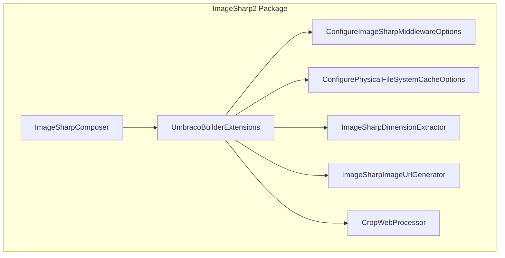

# 9.2 ImageSharp2 Variant: Differences and Migration Considerations

## Overview

The `Umbraco.Cms.Imaging.ImageSharp2` package provides a drop-in compatibility layer for applications that depend on ImageSharp 2.x behavior while running on .NET 10. It mirrors the same namespace and registration APIs as the default ImageSharp 3.x package but retains the 2.x method signatures, defaults, and processing behavior. This ensures that upgrading to Umbraco CMS on .NET 10 does not require code changes or adjustments when third-party libraries or existing code expect ImageSharp 2.x semantics.

## Architecture Overview



## Key Differences from the Default ImageSharp (3.x) Package

| Feature | ImageSharp2 (2.x) | ImageSharp (3.x) |
| --- | --- | --- |
| Package Versions | SixLabors.ImageSharp [2.1.x], SixLabors.ImageSharp.Web [2.0.x] | SixLabors.ImageSharp [3.x], SixLabors.ImageSharp.Web [3.x] |
| HMAC Request Authorization | Not supported | Supported via `HMACSecretKey` option |
| WebP Encoder Default | Lossy by default | Defaults to Lossless; overridden to Lossy in middleware |
| Cache-Buster Query Parameter | Uses `rnd` only | Supports both `rnd` and `v` |
| EXIF-Aware Identify API | `IImageInfo Image.Identify(Configuration, Stream)` | `ImageInfo Image.Identify(DecoderOptions, Stream)` |
| Image Size Retrieval | `Size size = image.Image.Size()` method | `Size size = image.Image.Size` property |
| Namespace and Registration | `Umbraco.Cms.Imaging.ImageSharp` (2.x) | `Umbraco.Cms.Imaging.ImageSharp` (3.x) |


## Component Structure

### ImageSharpComposer

*Path: src/Umbraco.Cms.Imaging.ImageSharp2/ImageSharpComposer.cs*

- Purpose: Registers the ImageSharp2 package during startup.
- Methods:- `void Compose(IUmbracoBuilder builder)` — calls `builder.AddUmbracoImageSharp()` to wire up all services and middleware.

### UmbracoBuilderExtensions.AddUmbracoImageSharp

*Path: src/Umbraco.Cms.Imaging.ImageSharp2/UmbracoBuilderExtensions.cs*

- Purpose: Configures dependency injection and middleware ordering for ImageSharp 2.x.
- Registration steps:1. `Configuration.Default`
2. `IImageDimensionExtractor` → `ImageSharpDimensionExtractor`
3. `IImageUrlGenerator` → `ImageSharpImageUrlGenerator`
4. `builder.Services.AddImageSharp()`- `.ClearProviders()`
- `.AddProvider<WebRootImageProvider>()`
- `.AddProcessor<CropWebProcessor>()`
5. Middleware options via `ConfigureImageSharpMiddlewareOptions`
6. Cache options via `ConfigurePhysicalFileSystemCacheOptions`
7. Inserts `UseImageSharp()` **before** static file handling in the pipeline.

### ConfigureImageSharpMiddlewareOptions

*Path: src/Umbraco.Cms.Imaging.ImageSharp2/ConfigureImageSharpMiddlewareOptions.cs*

| Type | Description |
| --- | --- |
| `Configuration` | ImageSharp configuration instance |
| `IOptions<ImagingSettings>` | Umbraco imaging settings from configuration |


- Constructor Dependencies:
- Public Method:- `void Configure(ImageSharpMiddlewareOptions options)`- Assigns `options.Configuration`.
- Applies `BrowserMaxAge`, `CacheMaxAge`, `CacheHashLength`.
- On parsing commands, strips `width`/`height` if they exceed configured maxima.
- On preparing response, when `rnd` is present, disables revalidation and adds `immutable` cache directive.

### ConfigurePhysicalFileSystemCacheOptions

*Path: src/Umbraco.Cms.Imaging.ImageSharp2/ConfigurePhysicalFileSystemCacheOptions.cs*

| Type | Description |
| --- | --- |
| `IOptions<ImagingSettings>` | Umbraco imaging settings |
| `IHostEnvironment` | Maps relative paths to physical file system |


- Constructor Dependencies:
- Public Method:- `void Configure(PhysicalFileSystemCacheOptions options)`- `options.CacheFolder` ← mapped `ImagingSettings.Cache.CacheFolder`
- `options.CacheFolderDepth` ← `ImagingSettings.Cache.CacheFolderDepth`

### ImageSharpDimensionExtractor (2.x)

*Path: src/Umbraco.Cms.Imaging.ImageSharp2/Media/ImageSharpDimensionExtractor.cs*

| Type | Description |
| --- | --- |
| `Configuration` | ImageSharp configuration instance |


| Property | Type |
| --- | --- |
| `SupportedImageFileTypes` | `IEnumerable<string>` |


- Constructor Dependencies:
- Properties:
- Public Method:- `Size? GetDimensions(Stream? stream)`- Calls `Image.Identify(_configuration, stream)`
- Swaps width/height when EXIF orientation indicates rotation.

### ImageSharpImageUrlGenerator (2.x)

*Path: src/Umbraco.Cms.Imaging.ImageSharp2/Media/ImageSharpImageUrlGenerator.cs*

| Type | Description |
| --- | --- |
| `Configuration` | ImageSharp configuration instance |


| Property | Type |
| --- | --- |
| `SupportedImageFileTypes` | `IEnumerable<string>` |


- Constructor Dependencies:
- Properties:
- Public Method:- `string? GetImageUrl(ImageUrlGenerationOptions? options)`- Returns `null` if `options?.ImageUrl` is `null`.
- Builds query parameters for crop (`cc`), focal point (`rxy`), mode, anchor, width, height, format, quality.
- Uses `rnd` as cache-buster.
- **No** HMAC token is generated or appended.

### CropWebProcessor (2.x)

*Path: src/Umbraco.Cms.Imaging.ImageSharp2/ImageProcessors/CropWebProcessor.cs*

| Constant | Value | Purpose |
| --- | --- | --- |
| `Coordinates` | `"cc"` | Four-value crop coordinates |
| `Orient` | `"orient"` | EXIF orientation handling |


| Property | Type |
| --- | --- |
| `Commands` | `IEnumerable<string>` |


- Constants:
- Properties:
- Public Methods:

| Method | Description |
| --- | --- |
| `FormattedImage Process(FormattedImage image, ILogger logger, CommandCollection commands, CommandParser parser, CultureInfo culture)` | Parses and clamps four float coordinates, transforms them based on EXIF orientation, and applies a crop operation. |
| `bool RequiresTrueColorPixelFormat(...)` | Always returns `false`. |


## Migration Checklist

To transition from ImageSharp2 (2.x) to the default ImageSharp (3.x) package:

1. **Update package references**- Remove:

```xml
     <PackageReference Include="Umbraco.Cms.Imaging.ImageSharp2" ... />
```

- Add:

```xml
     <PackageReference Include="Umbraco.Cms.Imaging.ImageSharp" Version="*" />
```

1. **Clear media cache**

Delete the contents of `~/umbraco/Data/TEMP/MediaCache`.

1. **No code changes required**

Both packages share the same namespace and registration API.

1. **Review behavior changes**- **HMAC signing** is now available—configure `ImagingSettings.HMACSecretKey` to enable secure URLs (`v` or `rnd`).
- The **WebP encoder** default is now overridden to Lossy in `ConfigureImageSharpMiddlewareOptions`.
- The Image.Identify API and `Size` retrieval have changed signatures (see **Key Differences**).

## Key Classes Reference

| Class | Location | Responsibility |
| --- | --- | --- |
| `ImageSharpComposer` | src/Umbraco.Cms.Imaging.ImageSharp2/ImageSharpComposer.cs | Auto-registers ImageSharp2 via `IComposer` |
| `UmbracoBuilderExtensions` | src/Umbraco.Cms.Imaging.ImageSharp2/UmbracoBuilderExtensions.cs | Registers services and middleware for ImageSharp2 |
| `ConfigureImageSharpMiddlewareOptions` | src/Umbraco.Cms.Imaging.ImageSharp2/ConfigureImageSharpMiddlewareOptions.cs | Configures ImageSharp2 middleware behavior |
| `ConfigurePhysicalFileSystemCacheOptions` | src/Umbraco.Cms.Imaging.ImageSharp2/ConfigurePhysicalFileSystemCacheOptions.cs | Sets up physical file cache options |
| `ImageSharpDimensionExtractor` | src/Umbraco.Cms.Imaging.ImageSharp2/Media/ImageSharpDimensionExtractor.cs | Extracts dimensions from image streams using 2.x API |
| `ImageSharpImageUrlGenerator` | src/Umbraco.Cms.Imaging.ImageSharp2/Media/ImageSharpImageUrlGenerator.cs | Builds query-string URLs for ImageSharp2 processing |
| `CropWebProcessor` | src/Umbraco.Cms.Imaging.ImageSharp2/ImageProcessors/CropWebProcessor.cs | Implements EXIF-aware crop processor for 2.x |
